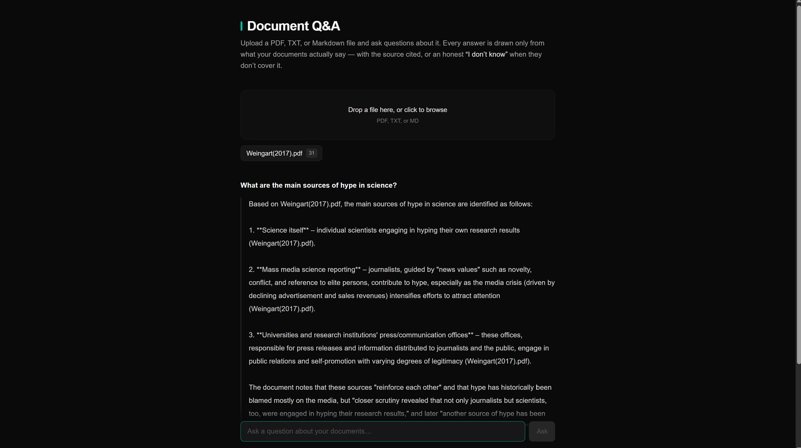
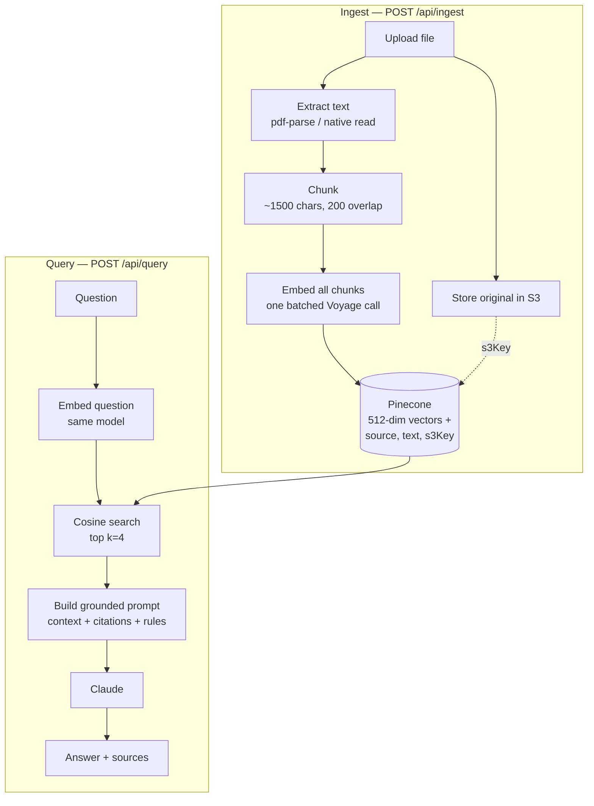

# Document Q&A — Retrieval-Augmented Generation

Upload PDF, TXT, or Markdown files and ask questions about them. Answers are generated **only** from the contents of your documents, with the source file cited for each claim — and an explicit "I don't know based on the documents provided" when the answer isn't there.

**Live:** https://rag-doc-qa-six.vercel.app




---

## Why this is not a chatbot with extra steps

A general-purpose LLM answers from its training data, which means it will confidently answer questions about documents it has never seen. This app is built so it can't do that:

- Answers are constructed from retrieved passages, not model memory.
- Every claim is attributed to the file it came from.
- Asked something the documents don't cover, it refuses instead of guessing — even when the model plainly knows the answer.

That last behaviour is the point of the whole system, and it's tested in both directions.

## How it works

Two pipelines. Ingestion runs once per uploaded document; querying runs on every question.



**Retrieval is semantic, not keyword.** Text is converted to vectors positioned so that similar meaning lands nearby, then a question is matched by cosine similarity. A question about "battery storage" finds the relevant passage whether or not those exact words appear in it.

## Stack

| Layer | Choice | Notes |
|---|---|---|
| Framework | Next.js 16 (App Router), TypeScript | Frontend and API routes in one deployable |
| Styling | Tailwind CSS v4 | CSS-first config, no config file |
| Answer generation | Anthropic — `claude-sonnet-5` | Grounded prompt with citation rules |
| Embeddings | Voyage — `voyage-3-lite` | 512 dimensions, batched per document |
| Vector search | Pinecone (serverless) | Cosine similarity, dense index |
| PDF extraction | `pdf-parse` v2 | Node `CanvasFactory` for serverless |
| File storage | AWS S3 | Original uploads retained, keyed in chunk metadata |
| Hosting | Vercel | Auto-deploy on push to `main` |

## Implementation notes

A few decisions that aren't obvious from the file listing:

**Chunk IDs are deterministic** (`<filename> <index>`). Re-uploading the same file overwrites its chunks rather than duplicating them, and the S3 key follows the same convention so both stores stay consistent. An earlier index-only scheme (`"0"`, `"1"`, …) silently overwrote chunks *across* documents — the second upload destroyed the first.

**Embeddings are batched, not parallelised.** The obvious `Promise.all(chunks.map(embed))` fires N simultaneous requests and hits the rate limit immediately. Voyage's API accepts an array of inputs, so one document is one request — fewer round trips and no rate-limit thrash.

**Chunk text is stored in the vector metadata.** Pinecone searches over vectors but returns metadata; without the original text stored alongside, there'd be nothing to hand the model at answer time.

**Client and server errors are distinguished.** Malformed uploads return 400 with a specific message; upstream failures return 500 and log the real error server-side. The client never sees internal detail, and the logs never say "bad request" about an outage.

**PDF parsing needed a serverless-specific fix.** `pdfjs` defaults to a DOM-based canvas factory that expects browser globals (`DOMMatrix`, `Path2D`) absent from Vercel's Node runtime — it worked locally and 500'd in production. `pdf-parse` ships a Node-compatible factory that has to be passed explicitly.

## Running locally

```bash
npm install
cp .env.example .env.local   # then fill in your keys
npm run dev
```

Requires accounts with Anthropic, Voyage AI, Pinecone, and AWS. The Pinecone index must be created as a **dense** index with **512 dimensions** and the **cosine** metric — the dimension is fixed at creation and must match the embedding model's output, or every upsert is rejected.

```
ANTHROPIC_API_KEY=
VOYAGE_API_KEY=
PINECONE_API_KEY=
PINECONE_INDEX=
AWS_ACCESS_KEY_ID=
AWS_SECRET_ACCESS_KEY=
AWS_REGION=
S3_BUCKET=
```

## Limitations

Honest scope, since this is a portfolio build rather than a product:

- **No auth or per-user isolation.** All documents share one Pinecone namespace; anyone using the live demo queries the same corpus.
- **No document deletion.** Uploads accumulate; removing a document means deleting its vectors directly in Pinecone.
- **Scanned PDFs won't work.** Text extraction reads the text layer; image-only PDFs need OCR, which isn't wired up.
- **Very large documents can hit embedding rate limits**, since one document is embedded in a single request.
- **No conversation memory.** Each question is answered independently; follow-ups like "what about the other one?" have no prior context to draw on.
